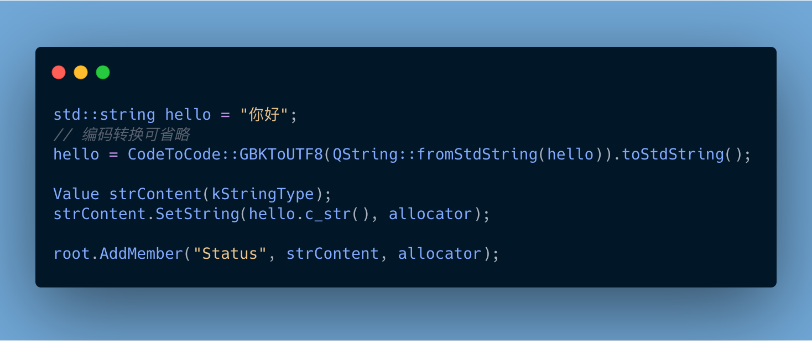

# :100:RapidJson 

#### :+1:中文字符串



<details>
<summary>Code</summary>
<markdown>
```cpp
std::string hello = "你好";
// 编码转换可省略
hello = CodeToCode::GBKToUTF8(QString::fromStdString(hello)).toStdString();

Value strContent(kStringType);
strContent.SetString(hello.c_str(), allocator);

root.AddMember("Status", strContent, allocator);
```
</markdown>
</details>


